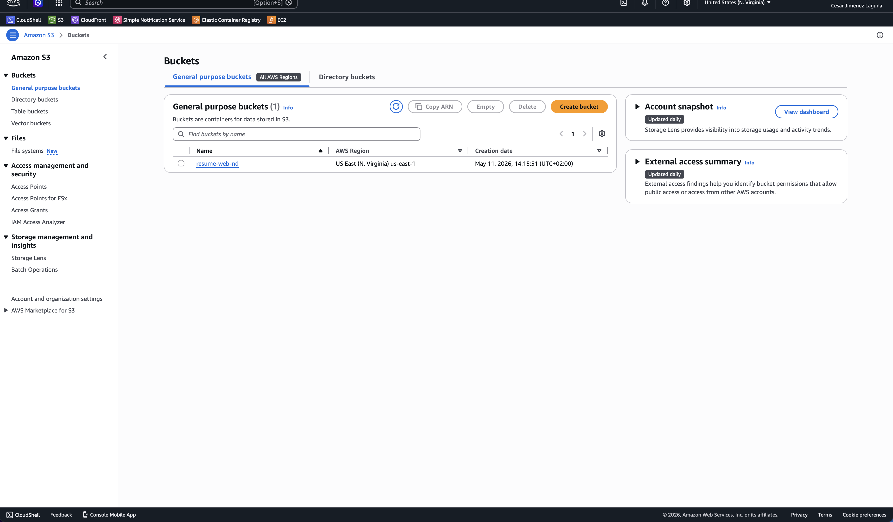
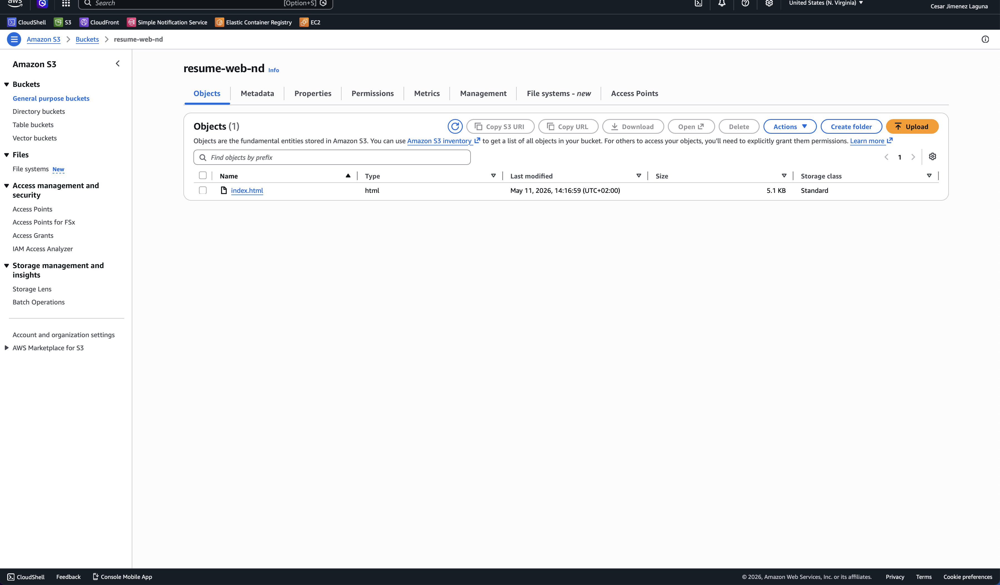
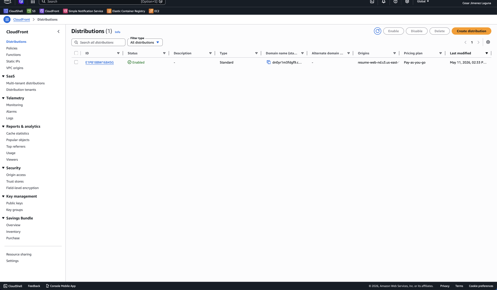
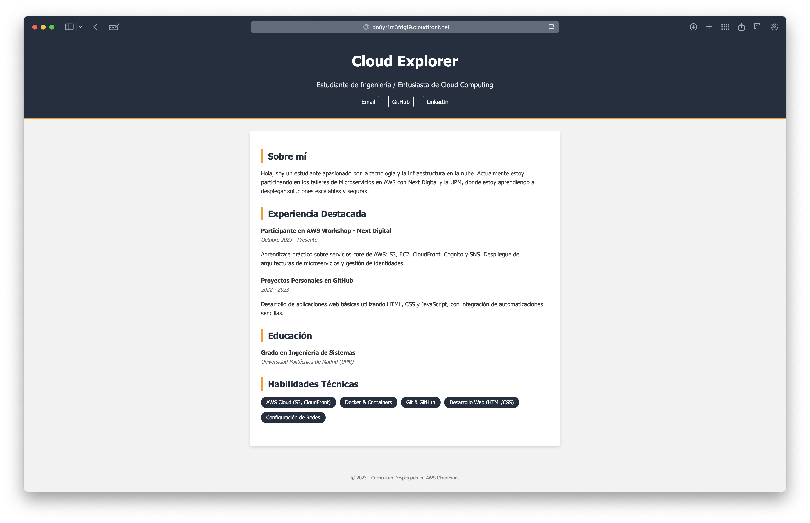
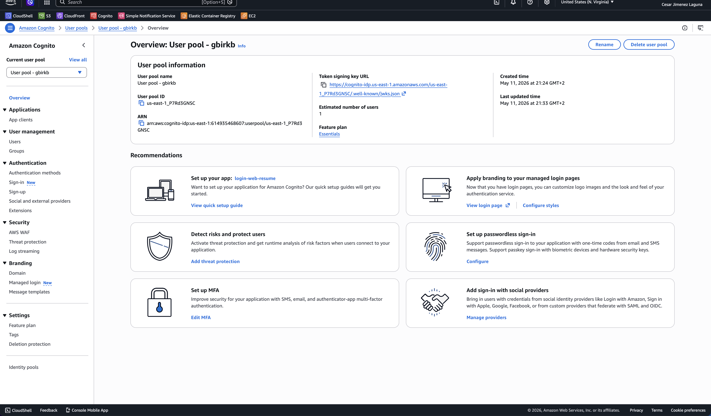
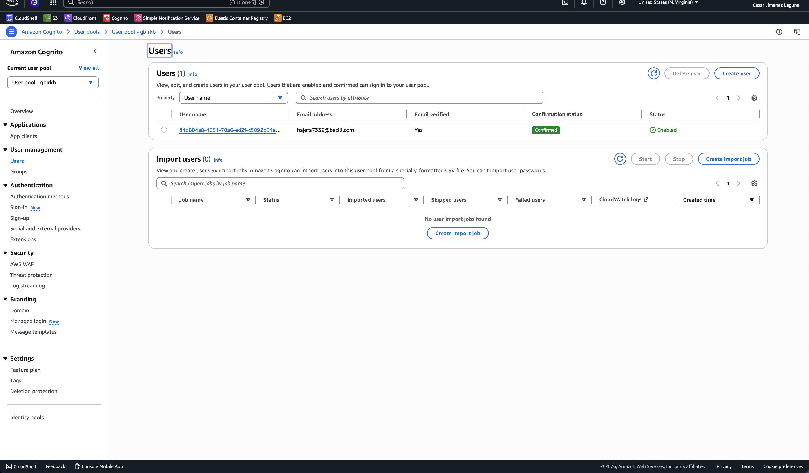
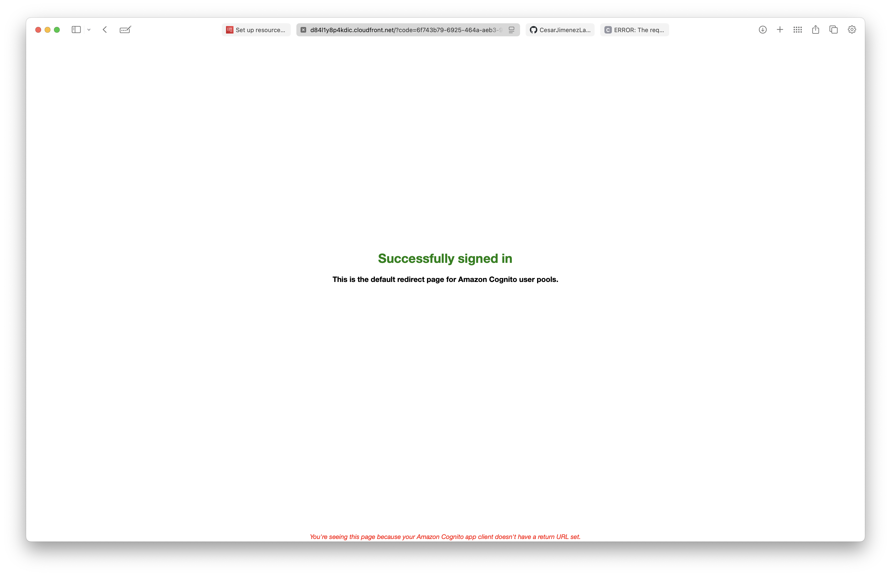
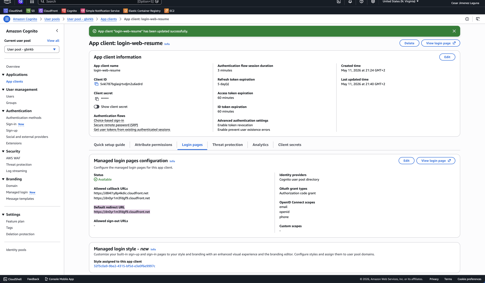

# AWS

## 1. Web estática formato currículum con S3 y CloudFront

### 1.1 Creación del backet en S3

#### 1.1.1 Contenido del bucket (index.html)

### 1.2 Creación de la distribución en CloudFront

### 1.3 Contenido de la Web

## 2. Configuración de Amazon Cognito

### 2.1 Creación de la pool de usuarios

### 2.2 Registrar usuario en Cognito

**Configuración**

**Feedback**

### 2.3 Redirección a la web creada tras realizar el log-in

**Configuración URL de redirección por defecto**

**Funcionamiento de la redirección**

<video src="./images/cognito/cognito-redireccion-web.mov" controls width="100%"></video>

